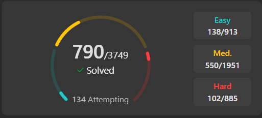

# LeetCode Solutions

This repository contains my solutions to LeetCode problems implemented in Java and Go, plus SQL practice problems.

## 📊 Statistics

- **Java**: ~700 solutions
- **Go**: ~34 solutions
- **SQL**: Database problems for learning


## 🚀 Quick Start

### Finding Solutions
- **Java**: Solutions organized in `Practice1-6.java` files (~4,000 lines each)
  - Use Ctrl+F to search for problem names or keywords
  - Check `References.java` for common algorithms and utilities
- **Go**: Solutions organized by difficulty in `go/easy/`, `go/medium/`, `go/hard/`
- **SQL**: All SQL problems in `sql/SQLPractice.sql`

### Working on New Solutions
- **Go**: Use `draft.go` in the root directory (gitignored for work-in-progress)
- **Java**: Add to the most recent Practice file or start Practice7.java when IDE slows down

## 📁 Structure

```
.
├── java/
│   └── src/
│       ├── Practice1.java      # ~4,500 lines of LeetCode solutions
│       ├── Practice2.java      # ~3,700 lines
│       ├── Practice3.java      # ~3,800 lines
│       ├── Practice4.java      # ~4,000 lines
│       ├── Practice5.java      # ~3,600 lines
│       ├── Practice6.java      # ~2,800 lines
│       └── References.java     # Utility functions and algorithms
├── go/
│   ├── easy/
│   │   └── solutions.go
│   ├── medium/
│   │   └── solutions.go
│   └── hard/
│       └── solutions.go
├── sql/
│   └── SQLPractice.sql         # SQL LeetCode problems
└── resources/
    └── progress/               # Progress screenshots
```


## 📈 Recent Progress

**November 2025:** Repository reorganization complete - focused on LeetCode solutions only
<br>


**August 2024:** Been doing SQL questions to supplement COMP2400 learning
<br>


**July 2024:**
<br>


**June 2024:**
<br>


**May 2024:**
<br>
 
